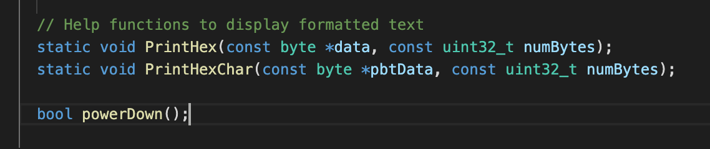
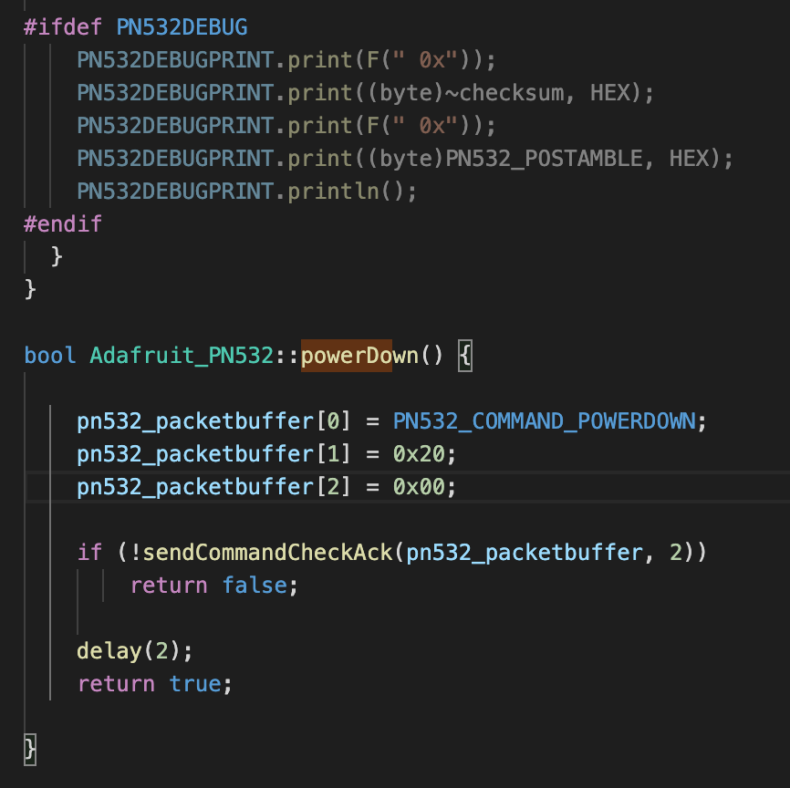
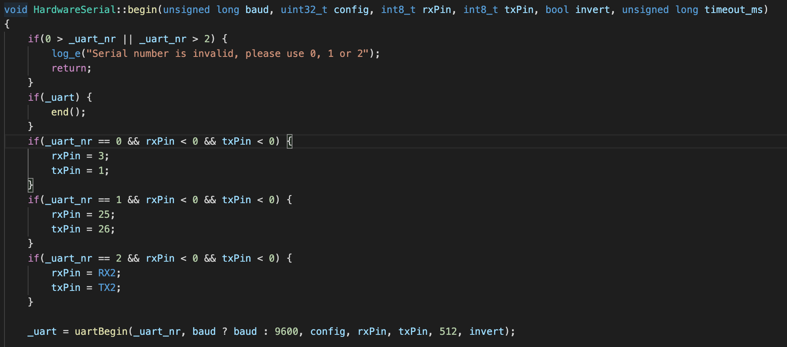
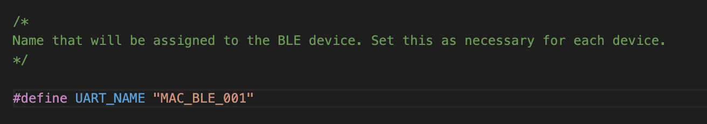
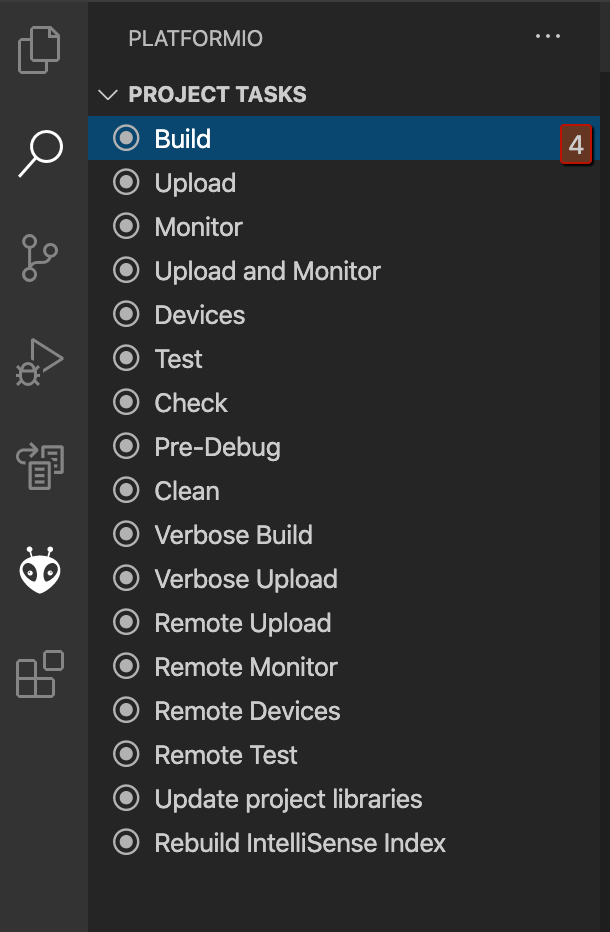

# mac-red-hardware

NOTE: All instructions are for developing on macOS, instructions should be similar for other OS’s.

## Install VSCode and PlatformIO
1. Download and install VSCode
2. Open the VSCode extension manager and search for and install the official PlatformIO extension.

## Install and modify the necessary libraries.
1. From the PlatformIO homepage in VSCode search for and and install the following libraries
- Adafruit PN532
- NeoPixelBus

2. Open the Adafruit_PN532.h located here - ‘~/.platformio/lib/Adafruit_PN532_ID29/Adafruit_PN532.h’
- add the following powerDown() method to the end of the Adafuit_PN532 class.


3. Open the Adagruit_PN532.cpp located here - ‘~/.platformio/lib/Adafruit_PN532_ID29/Adafruit_PN532.cpp’
- add the following definition for the powerDown method to the end of the file.


4. Open the ESP32 HardwareSerial.cpp located here - ‘~/.platformio/packages/framework-arduinoespressif32/cores/esp32/HardwareSerial.cpp’
- In the HardwareSerial::Begin method change the pin numbers for Serial1 to rxPin = 25 and txPin = 26
- In the same method change the queueLen parameter in the call to uartBegin to 512.


## Building and deploying.

### Com Center

- Connect the ESP32 via usb.
- Make sure no other process is using the adapter.
- Open main.cpp
- Locate the line towards the top that starts #define UART_NAME;



- Change the name in quotes to whatever the desired name is.
- This will be the name that is selected on the iPad.
- Select the PlatformIO Project tasks with the PlatformIO logo (little ant head sort of thing) on the left panel.





- Click build.
- Make sure there are no errors and the code compiles and links properly.
- Click upload.
- ESP32 will be located and binary will be uploaded.
- Once complete disconnect the usb cable to begin using the device.

## Display Controller

- Requires and St-link2 programmer - like this on [amazon](https://www.amazon.com/st-link-V2-Programaci%C3%B3n-stm8-STM32-emulador-Downloader-M89-Nueva/dp/B01J7N3RE6/ref=sxts_sxwds-bia-wc-nc-drs1_0?cv_ct_cx=st-link&dchild=1&keywords=st-link&pd_rd_i=B01J7N3RE6&pd_rd_r=c887d795-0516-4c2a-b5e2-b7a7e8e1c39e&pd_rd_w=7DM42&pd_rd_wg=92EmK&pf_rd_p=43f4b3f0-0b04-46ba-8a08-2e851d035e17&pf_rd_r=19AYSQ7V27E4MPXCX27H&psc=1&qid=1595950600&sr=1-1-f3947b35-9c59-4d7a-9603-b751e6eed25b)
- Connect programmer pins for power, ground, SWDIO, and SWCLK to microcontroller pins.

- Connect programmer to usb.
- Open the project in VSCode.
- Open main.cpp
- Select PlatformIO project tasks.
- Click on build and make sure there are no errors.
- Click on upload and let the process finish.
- Disconnect the programmer to begin using the device.

## Monitoring

- Both the com center and the display control devices can be monitored while active through their serial ports.
- For the com center connect the usb cable and find the serial dev created in ‘/dev/‘. Most likely something like ‘cu.SLAB_to_UART’.
- Within the the PlatformIO project tasks select monitor and then enter the number for the device if prompted.
- You can use any other serial monitor application by providing the device name and then baud rate of 9600.
- - For instance using screen:
 
 ```
 screen /dev/cu.SLAB_to_UART 9600
 ```
 
- For the display control an external use to uart device is necessary. 
- Follow the procedure for the ESP32.

## Testing

- Using Adafruit Bluefruit LE connect.
- Download and install the application.
- Open application and select the com center device.
- Select the uart button once the device has connected.
- Message from the com center, i.e. lipstick picked up or returned will be posted here.
- Messages following the json protocol can be sent from here to the com center.
- e.g. 

```
{“event”:”LIGHT_EFFECT”, “params”:{“location”:”255”, “whiteLevel”:”128”}}
```

will turn on all light to 50% white, the default all on.

```
{“event”:”LIGHT_EFFECT”, “params”:{“location”:”0”, “redLevel”:”255”}}
```
will turn on the top left light to full red.
			
- location can be set to 0 - 9 reading from the top left to the bottom right.
- Colors can be set with redLevel, greenLevel, blueLevel, and whiteLevel.
- Sending no color values is the same as black or off.

```
{“event”:”LIGHT_EFFECT”, “params”:{“location”:”255”}}
```

will turn off all lights. 

- Any RGB combination can be set.
- Adding an "animationTime" property to the params will fade the light in for the specified number of milliseconds.

```
{“event”:”LIGHT_EFFECT”, “params”:{“location”:”0”, “redLevel”:”255”, "blueLevel":"255", "animationTime":"2500"}}
```

will fade location 0 to purple over 2.5 seconds.

- Adding a "startTime" property to params will delay the start time of the cue by the specified number of milliseconds.

```
{“event”:”LIGHT_EFFECT”, “params”:{“location”:”0”, “redLevel”:”255”, "blueLevel":"255", "animationTime":"2500", "startTime":"1000"}}
```

will fade location 0 to purple over 2.5 seconds after a 1 second delay.

- Lifting and replacing lipsticks will trigger up and down message. These will appear in the Uart monitor.

## Troubleshooting 

- Readers are not responding when a lipstick is lifted or replaced.
	
	- If all readers in a tray are not responding check that all cables are connected properly.
	
	- If at least one reader is working properly
		
		- Test reader using a lipstick from a working location.
		
			- If this reader works, replace the RFID tag on the original lipstick and ensure that it seated properly.
			
			- If it still does not work replace the reader using a know working one following the directions in the installation instructions. Then test and repair if possible the non-funcitoning reader once it is deinstalled.

- Unit does not appear to be working. Lifting a lipstick does not trigger any action on the iPad or change the lighting and selecting a lipstick on the iPad does not affect the unit.

	- Reset the bluetooth connection.
	1. Open the admin console and select the Tap & Try hardware tab.
	2. Press disconnect.
	3. Connection should drop and then automatically reconnect.
	4. Press memorize to reset experience as normal.
	5. Confirm that unit is working as normal.
	6. If reconnection does not occur or other error exist, test hardware as described above.
